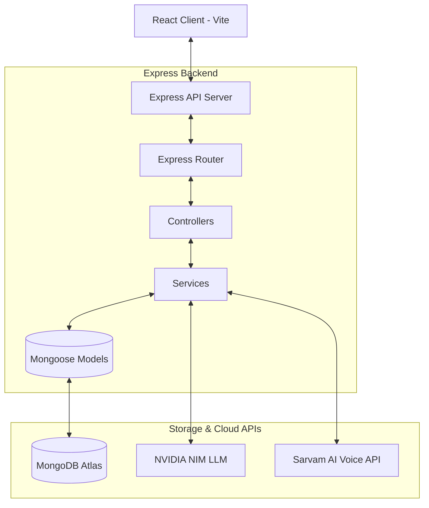

# 🎓 Vividya (विविद्या) — AI Life & Career Guide for Indian Students

Vividya is an advanced, AI-driven educational portal tailored for Indian college students. It combines state-of-the-art Large Language Models (LLM) and natural voice interfaces to help students organize their studies, build competitive resumes, prep for campus placements, and navigate mental wellness.

---

## 📌 Problem Statement
Many engineering and college students in India face challenges when preparing for placements:
1. **Generic Study Calendars**: Traditional schedulers fail to build custom timetables that adapt to user study hour preferences, priorities, or specific topics they want to learn.
2. **Clunky Resume Tools**: Standard builders lack professional templates and fail to provide ATS scoring or detailed career alignment critiques.
3. **No Interactive DSA/Technical Mock Interviews**: Students have access to static question banks but lack an environment to write answers and get evaluated with detailed scores and feedback.
4. **Stress and Placement Anxiety**: Placement drives are stressful; students lack personalized wellness logs and intervention techniques.

---

## 💡 The Solution: Vividya
Vividya addresses these challenges through a unified platform featuring:
- **🗣️ AI Tutor Chat (Voice & Text)**: A multilingual voice-enabled tutor supporting English, Hindi, Hinglish, and Marathi.
- **📅 Adaptive Timetable Scheduler**: Automatically translates chat lessons (e.g. *Deep Learning*) into structured 7-day calendars using specific rules (30-90m study blocks, 15-minute smart rest breaks, and focus categories).
- **📋 Stepper-Based Resume Builder**: A clean 5-step wizard that compiles details into base64 PDF templates stored persistently in local storage.
- **🧠 Career Advisor & Mock Interviewer**: Provides detailed resume critiques, DSA roadmaps, and an interview room where students type answers and get graded out of 10 by AI.

---

## 🛠️ High-Level System Architecture



---

## 🗂️ Core File Directory Structure

```
Vividya/
├── src/                      # Frontend SPA
│   ├── api/
│   │   └── client.js         # Axios Wrapper Client
│   ├── pages/
│   │   ├── ChatPage.jsx      # Tutor Chat with Voice Support
│   │   ├── CareerPage.jsx    # Career Guides, History, & Mock Interviews
│   │   ├── ResumePage.jsx    # 5-Stage Stepper Resume Builder
│   │   └── TimetablePage.jsx # Timetable Calendar Grid
│   ├── App.jsx               # Routes & Stepper logic
│   └── main.jsx
├── vividya-backend/          # Node.js Express API
│   ├── controllers/          # Endpoint Handlers
│   │   ├── careerController.js
│   │   └── chatController.js
│   ├── models/               # MongoDB Collections
│   │   ├── CareerProfile.js
│   │   ├── ResumeAnalysisHistory.js
│   │   ├── StudyPlan.js
│   │   └── User.js
│   ├── services/             # Core Logic & Third-Party APIs
│   │   ├── nvidiaService.js  # Llama NIM Interface
│   │   ├── sarvamService.js  # TTS / STT Voice APIs
│   │   └── timetableService.js # Calendar Scheduler
│   └── app.js                # Server Entry point
├── LICENSE                   # Open Source MIT License
├── README.md                 # Complete Guide
└── architecture.md           # Mermaid Visualizations
```

---

## ⚙️ Dependencies

### Frontend
- **React.js** (Vite build system)
- **TailwindCSS** (Vanilla CSS configurations)
- **lucide-react** (SVG vector icons)
- **react-router-dom** (SPA client-side navigation)
- **html2pdf.js** (CDN load for vector client PDF export)

### Backend
- **Express.js** (Routing framework)
- **mongoose** (MongoDB object modeling)
- **pdf-parse** (PDF resume parsing)
- **jsonwebtoken** (Token authentication)
- **axios** (Third-party integration queries)
- **dotenv** (Secure environment configuration)

---

## 🔑 Test Credentials
For immediate local testing, you can bypass signup and use the preset demo account:
- **Email**: `demo@vividya.ai`
- **Password**: `Demo@12345`

---

## 🚀 Getting Started & Local Setup

### 1. Setup Backend
1. Open the backend folder:
   ```bash
   cd vividya-backend
   ```
2. Install Node modules:
   ```bash
   npm install
   ```
3. Create a `.env` file in the backend root directory:
   ```env
    PORT=3000
    MONGODB_URI=your_mongodb_atlas_uri
    JWT_SECRET=your_secret_signing_key
    NVIDIA_API_KEY=your_nvidia_nim_key
    SARVAM_API_KEY=your_sarvam_api_key
    QDRANT_CLUSTER_ENDPOINT=your_qdrant_cluster_url
    QDRANT_API_KEY=your_qdrant_api_key
    QDRANT_COLLECTION=vividya_notes
    ```
4. Start backend in development mode:
   ```bash
   npm run dev
   ```

### 2. Setup Frontend
1. Open a new terminal in the project root:
   ```bash
   npm install
   ```
2. Run the Vite developer server:
   ```bash
   npm run dev
   ```
3. Open `http://localhost:3001` in your browser.

---

## 📄 Open Source License
This project is licensed under the [MIT License](LICENSE).
