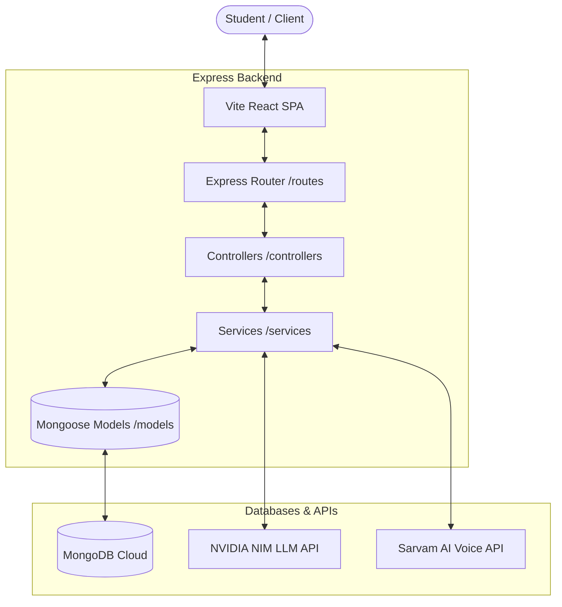

# Project Architecture & File Structure

This document outlines the architectural components and data flow of Vividya.

---

## 📐 High-Level Architecture Flow

The flowchart below demonstrates how the React frontend, Node/Express backend, and the MongoDB & AI APIs interact:



---

## 🗂️ File & Directory Structure

A layout of the primary files and folders in the workspace:

```
Vividya/
├── src/                      # Frontend Source
│   ├── api/
│   │   └── client.js         # Axios Instance Wrapper
│   ├── components/           # Reusable UI Blocks
│   ├── pages/                # Page Components
│   │   ├── ChatPage.jsx      # AI Tutor Chat Room
│   │   ├── CareerPage.jsx    # Career Advisor & Mock Interview
│   │   ├── ResumePage.jsx    # Step-by-Step Resume Builder
│   │   └── TimetablePage.jsx # Timetable Planner Calendar
│   ├── App.jsx               # Application Routes & Stepper logic
│   └── main.jsx
├── vividya-backend/          # Express Backend
│   ├── config/               # Database Connection & logger configs
│   ├── controllers/          # Request/Response Handlers
│   │   ├── chatController.js
│   │   └── careerController.js
│   ├── models/               # Mongoose DB Schemas
│   │   ├── User.js
│   │   ├── StudyPlan.js
│   │   ├── CareerProfile.js
│   │   └── ResumeAnalysisHistory.js
│   ├── routes/               # API Endpoints
│   ├── services/             # Core Business/AI Logic
│   │   ├── nvidiaService.js  # Meta Llama Generation Service
│   │   ├── sarvamService.js  # TTS and STT Service
│   │   └── timetableService.js # Lesson Curriculum Scheduler
│   ├── .env                  # Port, DB, & API Keys (Git Ignored)
│   └── app.js                # Server Bootstrap
├── LICENSE                   # Open Source MIT License
├── README.md                 # Project Overview & Setup Instructions
└── architecture.md           # Architecture Diagrams & File Map
```

---

## 🔄 Core Data Flow Scenarios

### 1. Timetable Plan Generation
1. Student clicks **"Generate Weekly Plan"** below an AI tutor message in AI Chat.
2. Frontend makes a request to `/timetable/generate` containing the chat text.
3. Backend service queries the NVIDIA Meta-Llama model with the chat topic to get an array of sub-topics/lessons.
4. Timetable scheduler splits the sub-topics, injects rest breaks, assigns adaptive focus levels, and schedules them.
5. Saved plan is returned, and Frontend redirects to the **Study Plan** calendar.

### 2. Resume Compilation
1. Student fills wizard stages. Under **Extras** step, clicks **"Generate resume with AI"**.
2. Frontend sends profile data to NVIDIA NIM, which parses and structures it as structured JSON.
3. App updates the resume state, and rendering the HTML sheet template.
4. User clicks **"Save & View PDF"**. Frontend loads `html2pdf.js` from CDN, converts the template to a vector PDF, stores it as a Base64 URI inside local storage, and displays it in an embedded PDF iframe.
